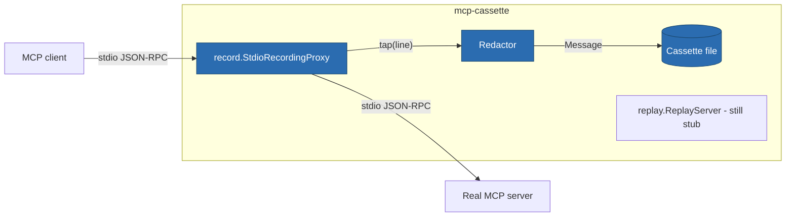

# ITER_01 — Record

## §01 · Concept

> Unchanged — see SKELETON § 01.

## §02 · Architecture



Schema changes: **none** — the skeleton's `Cassette`/`Message` models are populated,
not extended. Two behaviors those fields imply are now pinned down:

- `t_offset_ms` is measured from proxy start (monotonic clock), recorded for **every**
  message. Replay does not sleep on these by default; they exist for fault injection
  (`delay` faults can scale real timing) and human inspection.
- `protocol_version` and `server_info` are extracted by watching for the `initialize`
  request/response pair as it passes through — extraction is *observational*; the proxy
  never modifies bytes in flight.

## §03 · Tech Stack

> Unchanged — see SKELETON § 03. No new dependencies: capture is stdlib `json` +
> `anyio` + the pydantic models already present.

## §04 · Backend

### New/changed modules

- `record/proxy.py` — real implementation. The skeleton's passthrough gains a `tap`
  on both directions feeding a `SessionRecorder`.
- `record/recorder.py` (new) — `SessionRecorder`: line → `Message` classification,
  sequence numbering, timing, initialize-watching, in-memory buffer.
- `cassette.py` — `RedactionRule.apply(payload) -> payload` and the write path.
- `cli.py` — `record` subcommand wired: `--cassette PATH`, repeatable
  `--redact LOCATOR[=REPLACEMENT]`, `-- CMD [ARGS...]`.

### Message classification (deterministic, transport-level)

A decoded JSON object is classified from JSON-RPC shape alone:
`method` + `id` → `request`; `id` without `method` → `response`; `method` without
`id` → `notification`; undecodable line → `raw` (stored verbatim as `str`, one warning
per session). Sender is which pipe it arrived on. Server→client *requests* (sampling)
are recorded like any other message — replay-side handling is deferred (see ITER_02).

### Redaction (in MVP by design — cassettes get committed to repos)

Applied at **write time only**, to a deep copy: in-flight traffic is untouched.
Default rule set, always on unless `--no-default-redactions`:
key-glob `*token*`, `*secret*`, `*password*`, `*apikey*`/`*api_key*`, `authorization`
(case-insensitive) anywhere in any payload → `"REDACTED"`, and the matching `Message`
gets `redacted: true`. User rules add key-globs or JSON pointers. Redaction is
structural (keys), not content-sniffing — content entropy scanning is out of MVP scope.

### Write path

- Buffer in memory; write once on session end. Agent test sessions are short; a
  streaming/append format is not worth the diffability cost. If memory pressure ever
  matters it is a post-MVP concern.
- `Cassette.save` is atomic (`.tmp` + `os.replace`), `indent=2`, `sort_keys` off but
  field order fixed by pydantic model order → stable diffs.
- **Shutdown paths all finalize the cassette:** server exits (EOF on its stdout) →
  drain, write, exit with server's code; client closes stdin → forward EOF, drain,
  write; SIGINT/SIGTERM → task-group cancel, write what was captured, exit 130.
  An interrupted recording therefore still yields a valid, loadable cassette.

### Concurrency gotchas addressed (library-specific analogues of the reference list)

- **Pipe deadlock:** stderr is pumped continuously (established at skeleton); all three
  pumps live in one `anyio` task group so any pipe closing cancels the others cleanly.
- **Partial reads:** the framing helper buffers until `\n`; a final unterminated
  fragment at EOF is treated as a complete line (some servers omit the last newline).
- **No shared-state races:** `SessionRecorder.on_line` is the only writer to the
  buffer and both taps call it from the same task group — guard with an `anyio.Lock`
  anyway so `seq` stays strictly ordered under any scheduler.

### Tests for this iteration

Record against `tests/reference_server` driven by a scripted client stub
(initialize → tools/list → tools/call ×2 → a notification): assert cassette validates,
message count and ordering, initialize extraction, redaction of a planted
`api_key` field, atomicity (kill mid-session → valid cassette), `raw` handling
(reference server gains a `--noisy-stdout` flag for this).

### Run locally

```
uv run mcp-cassette record --cassette demo.json -- python tests/reference_server/server.py
uv run mcp-cassette inspect demo.json   # now prints real per-method counts + timing span
```

Environment variables: none added.

## §05 · Frontend / Developer Surface

> Unchanged — see SKELETON § 05. (`record` and `inspect` graduate from stub to real
> exactly as the skeleton's "registered but loud" convention prescribed; no new
> surface is introduced.)
