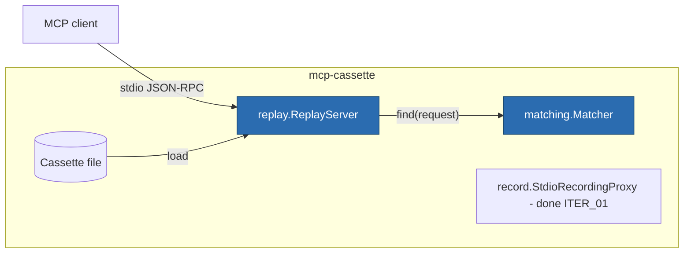

# ITER_02 — Replay

## §01 · Concept

> Unchanged — see SKELETON § 01.

## §02 · Architecture



`MatchConfig` (defined in SKELETON § 02) gets its semantics finalized here — fields
unchanged, meanings now normative:

- **`match_on: ["method", "params"]`** — an incoming client request matches a recorded
  client request when the listed components are structurally equal after removing
  `ignore_params` paths. JSON-RPC `id` is **never** matched on; the response is
  re-stamped with the incoming request's `id`.
- **`ordering`** — `per_method` (default): recorded requests form a FIFO queue *per
  method*, so repeated `tools/call` with identical shape consume successive recorded
  responses, but call order *across* methods is free. This is the LLM-non-determinism
  accommodation from the report review: agents reorder across tools, but the Nth
  identical call should get the Nth recorded answer. `strict`: one global queue, any
  out-of-order request is unmatched. `none`: pure shape match, first hit wins,
  responses reusable.
- **`on_unmatched: "error"`** — replay sends a JSON-RPC error
  (`code: -32001, message: "mcp-cassette: no recorded interaction matches …"` with the
  offending method + a params digest), records the miss, and **exits non-zero at
  session end** so CI fails visibly rather than hanging an agent.
- **`rewrite_protocol_version`** — default `false`: the recorded `initialize` result is
  replayed verbatim and a mismatch with the client's requested version logs one
  warning. Opt-in `true` rewrites `protocolVersion` in the initialize result to the
  client's requested value. Verbatim-by-default is the honest choice: a cassette is
  evidence of what the server actually said.

## §03 · Tech Stack

> Unchanged — see SKELETON § 03. No new dependencies; the matcher is structural
> comparison over parsed JSON (stdlib) and the server reuses `record/pump.py`'s framing.

## §04 · Backend

### New/changed modules

- `matching.py` — real: canonicalization, `ignore_params` removal (JSON-pointer
  deletion on deep copies), per-`ordering` lookup structures built once at load.
- `replay/server.py` — real: reads client lines from stdin, responds on stdout,
  emits recorded notifications, never touches the network or spawns anything.
- `cli.py` — `serve CASSETTE [--ordering X] [--ignore-param PTR]... [--faults FILE]`
  wired (`--faults` parses but errors "faults land in ITER_04" — loud-stub convention).

### Replay semantics (the decisions that make it deterministic)

1. **initialize** is special-cased only in that it is always answerable: matched by
   method alone, params ignored (clients differ in `clientInfo`), response verbatim
   per `rewrite_protocol_version` above. The client's `notifications/initialized` is
   accepted and not matched against anything.
2. **Client requests** → matcher → recorded response, re-stamped `id`, written as one
   line. Responses are sent in arrival order (no artificial sleeps; `t_offset_ms` is
   ignored during plain replay — determinism and speed are the product).
3. **Recorded server notifications** replay *anchored to their trigger*: a notification
   that was recorded between client request N's arrival and its response is emitted
   immediately after the matched response for N. Free-floating notifications recorded
   before any request (rare) are emitted after the initialize response. Anchoring is
   computed once at load from `seq` intervals.
4. **Recorded server→client requests (sampling/elicitation):** `Cassette.load` detects
   them; `ReplayServer` refuses to start with
   `UnsupportedCassetteFeature("server-initiated requests; see roadmap")`. Refusing
   loudly at load beats deadlocking an agent mid-test. Specialized sampling replay is
   post-MVP (deferred list lives on ITER_04).
5. **Client notifications** (`notifications/cancelled` etc.) are accepted and ignored —
   they require no response and matching them adds nothing in MVP.
6. **Shutdown:** EOF on stdin → flush, exit 0 if no unmatched misses, exit 3 if any
   (with a stderr summary listing them) — the CI-visible failure signal.

### Determinism guarantee (stated so tests can assert it)

Same cassette + same request sequence (up to the freedoms `ordering` grants) ⇒
byte-identical response sequence modulo `id` re-stamping. No wall-clock reads in the
response path.

### Tests for this iteration

Round-trip: record the ITER_01 scripted session, then run the same scripted client
against `ReplayServer` and assert semantically identical results with the real server
gone. Plus: per-method queue consumption (two identical `tools/call`s → distinct
recorded results, in order), `ignore_params` (client varies an ignored field, still
matches), unmatched → error + exit 3, notification anchoring, sampling-cassette
refusal (hand-built fixture cassette), protocol-version warning vs rewrite.

### Run locally

```
uv run mcp-cassette serve demo.json          # drop-in replacement for the server command
# e.g. point a Claude Code MCP server entry at exactly this command
```

Environment variables: none added.

## §05 · Frontend / Developer Surface

> Unchanged — see SKELETON § 05. (`serve` graduates stub→real per the skeleton
> convention; flag surface as registered there.)
