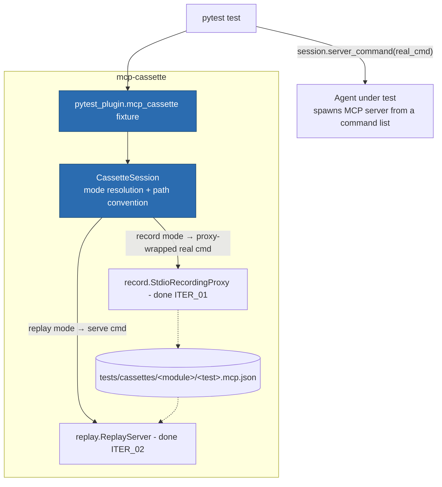

# ITER_03 — pytest fixture

## §01 · Concept

> Unchanged — see SKELETON § 01.

## §02 · Architecture



One new configuration concept, no cassette-schema change:

| Entity | Key fields |
|---|---|
| `CassetteSession` | `mode: "once" \| "none" \| "all" \| "new_episodes"`, `cassette_path: Path`, `match: MatchConfig`, `server_command(real_cmd: list[str]) -> list[str]`, `faults` (attribute reserved; populated in ITER_04) |

The ergonomic core — how interception actually happens, since the agent under test
spawns its own MCP servers from configuration: **the fixture does not monkeypatch
anything.** It hands the test a *command list* to plug into the agent's server config.
In record mode that command is the proxy wrapping the real server; in replay mode it is
`python -m mcp_cassette serve <cassette> …`. Command substitution is the whole trick,
which is what keeps Claude Code and any other client unmodified.

## §03 · Tech Stack

> Unchanged — see SKELETON § 03. No new runtime dependencies; `pytest` remains a
> `[test]` extra, and the `pytest11` entry point registered at skeleton now loads a
> real plugin module.

## §04 · Backend

### New/changed modules

- `pytest_plugin.py` — real: fixture, marker, ini options, session-end reporting.
- `session.py` (new) — `CassetteSession`: mode resolution, path convention, lifecycle
  (start proxy/replay bookkeeping, finalize, raise on violations).

### Record modes (vcrpy semantics, adapted)

| Mode | Cassette absent | Cassette present |
|---|---|---|
| `once` (default) | record | replay |
| `none` | **fail the test** ("no cassette and recording forbidden") | replay |
| `all` | record | re-record (overwrite atomically on success) |
| `new_episodes` | record | replay; unmatched requests fall through to the *real* server via the recording proxy and are appended |

`new_episodes` is the one mode where replay and record compose: `CassetteSession`
wires `ReplayServer` misses to a live proxy instead of the ITER_02 error path. Mode
resolution precedence: `MCP_CASSETTE_MODE` env var (the variable reserved at
SKELETON § 04) > `@pytest.mark.mcp_cassette(mode=…)` > ini `mcp_cassette_mode` >
`once`. CI sets `MCP_CASSETTE_MODE=none` so no pipeline ever silently hits a live
server.

### Path convention and configuration

- Default cassette path: `tests/cassettes/<test_module>/<test_name>.mcp.json`
  (parametrized tests get the pytest node-id suffix, sanitized). Override via marker
  `cassette=` or ini `mcp_cassette_dir`.
- Marker accepts `mode`, `cassette`, `ignore_params`, `ordering`,
  `rewrite_protocol_version` — the last three construct the `MatchConfig` defined in
  SKELETON § 02 with ITER_02 semantics.
- **Cached-config trap** (from the gotcha list): the plugin reads `MCP_CASSETTE_MODE`
  at *fixture setup time*, never at import time, and caches nothing module-level — so
  tests that set the env var via `monkeypatch` behave correctly.

### Test-failure semantics

- Replay misses (`on_unmatched` hits) surface as a **test failure** with the miss
  summary in the assertion message — not just a non-zero subprocess somewhere.
  `CassetteSession.finalize()` collects the ITER_02 stderr summary/exit code and
  raises.
- A recording that captured zero messages fails the test ("agent never spoke to the
  proxied server — is the command wired in?") rather than writing a useless cassette.

### Tests for this iteration (self-hosting: pytester)

Use pytest's `pytester` fixture to run generated mini-suites end-to-end against the
reference server: `once` records then replays on second run; `none` fails without a
cassette; `all` re-records a changed server response; `new_episodes` appends exactly
the novel call; env-var precedence; miss → readable test failure; parametrized-test
path uniqueness. This suite is also the report's "user zero" stand-in until the
subagent-orchestration suite adopts it.

### Run locally

```
uv run pytest                      # plugin exercised via pytester
MCP_CASSETTE_MODE=none uv run pytest   # the CI posture
```

Environment variables: `MCP_CASSETTE_MODE` (optional; values = the four modes).

## §05 · Frontend / Developer Surface

The fixture is the primary developer surface from this iteration on. Minimal
canonical usage, which the README will lead with:

```python
def test_agent_summarizes_repo(mcp_cassette):
    cmd = mcp_cassette.server_command(["python", "tools/github_server.py"])
    result = run_my_agent(mcp_servers={"github": cmd})
    assert "summary" in result
```

First run records through the proxy; every run after replays offline. Loading/error
states in a CLI-and-fixture world = the failure messages specified in §04 — every
failure names its cause and the fix (missing cassette → the command to record one;
miss → the mismatched method and nearest recorded candidate). `inspect` (real since
ITER_01) is the debugging companion and gains a `--method` filter here.
