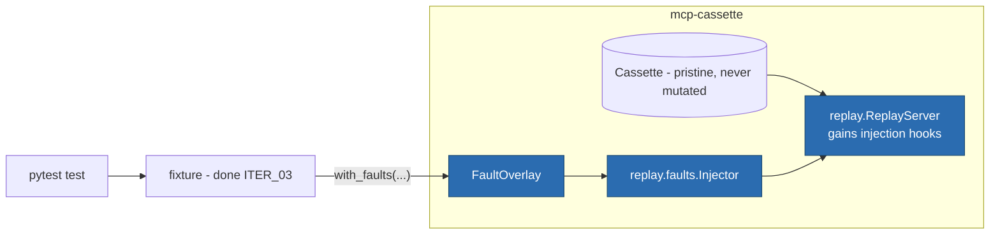

# ITER_04 — Fault injection (MVP terminator)

## §01 · Concept

> Unchanged — see SKELETON § 01.

## §02 · Architecture



`Fault` and `FaultOverlay` were defined in SKELETON § 02; semantics finalized here,
fields unchanged:

- **Targeting** reuses ITER_02's matcher vocabulary: `target.method` selects requests
  the same way `MatchConfig` does; `target.nth` (1-based, `None` = every match) counts
  matched occurrences within the session.
- **Overlay, never mutation:** faults live in a `FaultOverlay` — built in test code or
  loaded from a `<cassette>.faults.json` sidecar (same pydantic serialization as
  everything else). The recorded cassette stays pristine evidence; ITER_01's write path
  and ITER_02's load path are untouched.

## §03 · Tech Stack

> Unchanged — see SKELETON § 03. No new dependencies; delays and disconnects are
> `anyio` primitives already in the tree.

## §04 · Backend

### New/changed modules

- `replay/faults.py` — real: `Injector` consulted by `ReplayServer` at exactly one
  hook point — after a request is matched, before its response is written.
- `replay/server.py` — the hook call plus a `--faults FILE` path (the flag registered
  loud-stub in ITER_02 now works).
- `session.py` — `CassetteSession.with_faults(*faults) -> CassetteSession` (the
  attribute reserved in ITER_03), returning a copy so parametrized tests don't share
  state.

### Fault behaviors (each defined precisely so tests can assert them)

| `type` | `params` | Replay behavior at the hook point |
|---|---|---|
| `delay` | `ms: int` | sleep `ms`, then respond normally — exercises client timeout margins |
| `timeout` | — | never respond to this request; keep serving others (a hung tool, not a dead server) |
| `error` | `code: int = -32603`, `message: str` | replace the recorded response with a JSON-RPC error object, same `id` |
| `malformed` | `strategy: "truncate" \| "not_json" \| "wrong_id"` (default `truncate`) | emit a corrupted line: recorded response cut mid-payload / a non-JSON line / valid JSON stamped with an unknown `id` |
| `disconnect` | `after_response: bool = false` | close stdout+stdin and exit 0 — before responding (default) or just after — simulating server death mid-call vs between calls |

Interaction rules, fixed now to avoid ambiguity: at most **one fault fires per matched
request** — first overlay entry wins, a second match on the same request logs a
warning; a fired `timeout`/`disconnect` does not consume the recorded response for
per-method queue purposes (the queue position is spent — deterministic, and documented
as such); faults never apply to `initialize` unless `target.method` names it
explicitly.

### pytest ergonomics (what makes this the differentiator in practice)

```python
import mcp_cassette as mcc

@pytest.mark.parametrize("fault", [
    mcc.Fault.timeout("tools/call", nth=1),
    mcc.Fault.error("tools/call", code=-32000, message="rate limited"),
    mcc.Fault.disconnect("tools/call"),
])
def test_agent_survives_tool_trouble(mcp_cassette, fault):
    session = mcp_cassette.with_faults(fault)
    cmd = session.server_command(["python", "tools/github_server.py"])
    result = run_my_agent(mcp_servers={"github": cmd})
    assert result.completed_with_degraded_tools
```

One recorded cassette → a whole resilience matrix. `Fault.timeout(...)`-style
classmethod constructors are sugar over the SKELETON § 02 model. Fault parametrization
composes with any record mode, but `with_faults` under a *recording* mode fails fast
("faults apply to replay only") — no ambiguity about proxying faults onto live servers.

### Tests for this iteration

Per-behavior assertions against the scripted client (delay ≥ ms; timeout leaves other
methods answerable; error object shape + `id`; each malformed strategy; disconnect
pipe-close before/after), overlay sidecar load via CLI `serve --faults`, one-fault-
per-request rule, queue-position consumption, `initialize` exemption, and a pytester
run of the parametrized example above.

### Run locally

```
uv run mcp-cassette serve demo.json --faults demo.faults.json
```

Environment variables: none added (final MVP set: `MCP_CASSETTE_MODE` only).

## §05 · Frontend / Developer Surface

`with_faults(...)` and the `Fault.*` constructors join the fixture as the last MVP
surface; `inspect` gains `--faults FILE` to print which recorded requests an overlay
would hit — the dry-run answer to "is my `nth` right?". Failure-message convention
holds: an overlay entry that matches nothing in the cassette is reported at session
end as a warning naming the fault (misconfigured resilience tests should be visible,
not silently green).

## Out of MVP scope

Consciously deferred — the plan's hard edge:

- HTTP / Streamable-HTTP / SSE transport record and replay (the report's "stdio first, HTTP second"; session-capture semantics need their own design pass)
- Specialized replay of server→client requests — sampling/elicitation (recorded generically today; replay refuses loudly per ITER_02)
- Windows support (anyio makes it plausible; untested, not claimed)
- Security linting of recorded cassettes (suspicious tool descriptions — the report's "possible later feature")
- Content-based secret detection (entropy scanning; MVP redaction is key-structural only)
- Cassette format migration tooling (`format_version` field reserved for it)
- Richer inspect/diff UX beyond the current CLI summary and filters
- npm/TypeScript port
- Packaged GitHub Action
- Multi-server orchestration in a single cassette (compose multiple fixtures instead)
- Replay honoring recorded timing (`t_offset_ms` replay pacing)
