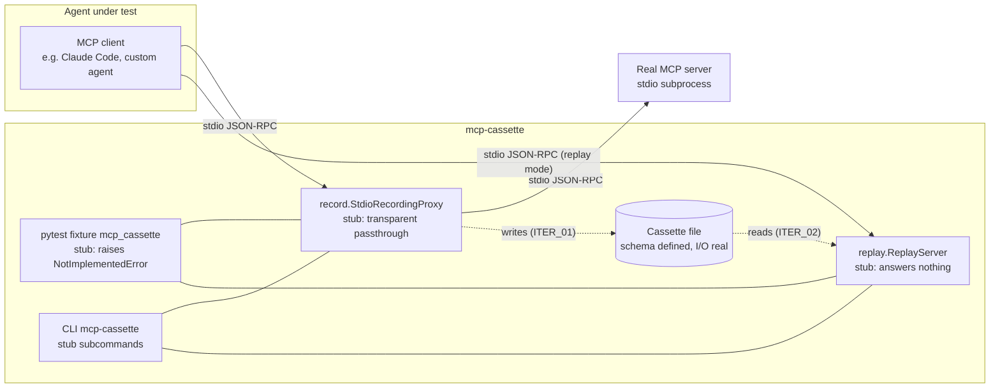

# SKELETON — mcp-cassette

## §01 · Concept

`mcp-cassette` is vcrpy for MCP. It records real MCP sessions between an agent (the
client) and an MCP server into **cassettes** — structured, diffable, committable files —
and later replays those cassettes as deterministic mock MCP servers, so agent test
suites stop hitting live servers and stop being flaky, slow, and expensive. It is for
Python developers building and testing MCP-consuming agents. **The single most important
flow:** a developer wraps their real server command with the recording proxy once, a
cassette is written, and from then on their pytest suite runs the agent against a replay
server rebuilt from that cassette — offline, deterministic, fast — with the option to
inject faults (timeouts, errors, malformed results) the live server would never
reliably produce.

Design stance that everything below follows: mcp-cassette operates at the **transport
level** (newline-delimited JSON-RPC over stdio), treats messages semi-opaquely, and does
**not** depend on the official `mcp` SDK at runtime. This keeps it client-agnostic
(works with Claude Code unmodified) and insulates it from SDK churn — the spec-churn
moat from the summary report.

## §02 · Architecture



### Data model (cassette schema — pydantic models, real at skeleton stage)

The schema is defined and validated from day one, even though nothing writes real
recordings yet. It is **message-generic**: every JSON-RPC message is captured whatever
its method, so resources/prompts/notifications record for free and only *replay
semantics* are scoped per-iteration.

| Entity | Key fields |
|---|---|
| `Cassette` | `format_version: int` (starts at 1), `recorded_at: datetime`, `transport: "stdio"`, `protocol_version: str` (from initialize), `server_info: {name, version}` (from initialize result), `messages: list[Message]` |
| `Message` | `seq: int`, `t_offset_ms: int` (from session start), `sender: "client" \| "server"`, `kind: "request" \| "response" \| "notification" \| "raw"`, `method: str \| None`, `msg_id: str \| int \| None`, `payload: dict \| str` (verbatim JSON object; `raw` kind stores the undecodable line as `str`), `redacted: bool` |
| `MatchConfig` | `match_on: list[str]` (default `["method", "params"]`), `ignore_params: list[str]` (JSON-pointer paths excluded from comparison), `ordering: "per_method" \| "strict" \| "none"` (default `per_method`), `on_unmatched: "error"` (only mode in MVP), `rewrite_protocol_version: bool` (default `false`) |
| `RedactionRule` | `locator: str` (key-glob like `*token*` or JSON pointer like `/result/content/0/text`), `replacement: str` (default `"REDACTED"`) |
| `Fault` | `target: {method: str, nth: int \| None}`, `type: "delay" \| "timeout" \| "error" \| "malformed" \| "disconnect"`, `params: dict` |
| `FaultOverlay` | `faults: list[Fault]` — sidecar/runtime object; **recorded cassettes are never mutated** |

Relationships: a `Cassette` owns ordered `Message`s; `MatchConfig`, `RedactionRule`,
and `FaultOverlay` are configuration applied *to* a cassette at record or replay time,
never stored inside `messages`.

### API surface (public Python API + CLI — this library has no HTTP routes)

| Surface | Signature (skeleton = stub) | One-liner |
|---|---|---|
| `Cassette.load(path) -> Cassette` | **real** | Parse + validate a cassette file (JSON) |
| `Cassette.save(path)` | **real** | Atomic write (`tmp` + rename), stable key order for diffability |
| `record.StdioRecordingProxy(server_cmd, cassette_path, redaction=[]).run()` | stub: passthrough only, writes empty cassette shell | Sit between client and server on stdio; record everything |
| `replay.ReplayServer(cassette, match=MatchConfig(), faults=None).run()` | stub: reads stdin, exits with clear error | Serve recorded responses deterministically |
| pytest fixture `mcp_cassette` | stub: raises `NotImplementedError("wired in ITER_03")` | Record-on-first-run / replay-thereafter per test |
| CLI `mcp-cassette record --cassette PATH [--redact RULE]... -- CMD [ARGS...]` | stub: runs passthrough proxy | Wrap a real server command for recording |
| CLI `mcp-cassette serve CASSETTE [--faults FILE]` | stub: prints "not implemented", exit 2 | Stand up a replay server as a drop-in server command |
| CLI `mcp-cassette inspect CASSETTE` | stub: prints message count from schema load | Human-readable cassette summary |

No auth, no database, no caching, no queues — none apply to a local testing library.

## §03 · Tech Stack

- **Language/runtime:** Python ≥ 3.10 (matches the MCP ecosystem floor; 3.10–3.13 in CI). Linux + macOS supported; Windows explicitly out of MVP scope.
- **Packaging:** `hatchling` build backend, `uv` for dev workflow, single package `mcp_cassette`, PyPI name `mcp-cassette` (verified available per report).
- **Async:** `anyio` — subprocess management and bidirectional pipe pumping; keeps the door open to trio users and is the same base the MCP ecosystem uses.
- **Schema/validation:** `pydantic` v2 — cassette validation with readable errors; `format_version` gate on load.
- **CLI:** stdlib `argparse` (with `REMAINDER` for the `-- CMD...` passthrough). Rationale: a testing library should be near-zero-dependency; no click.
- **pytest integration:** entry point group `pytest11` so the plugin auto-registers; `pytest` itself is *not* a runtime dependency of the core library (declared under a `[test]` extra plus dev deps) — importing the plugin module is guarded.
- **Deliberately NOT a dependency:** the official `mcp` SDK. It is a **dev-only** dependency, used to build the in-repo reference server that integration tests record against.
- **Dev tooling:** `ruff` (lint+format), `pytest`, GitHub Actions CI (lint + test matrix).

## §04 · Backend (the library)

### Module structure

```
mcp-cassette/
├── pyproject.toml
├── src/mcp_cassette/
│   ├── __init__.py          # re-exports: Cassette, MatchConfig, Fault, __version__
│   ├── cassette.py          # pydantic models, load/save, RedactionRule application
│   ├── matching.py          # MatchConfig + matcher (stub: NotImplementedError)
│   ├── record/
│   │   ├── __init__.py
│   │   ├── proxy.py         # StdioRecordingProxy (skeleton: passthrough, no capture)
│   │   └── pump.py          # bidirectional line pump (real at skeleton)
│   ├── replay/
│   │   ├── __init__.py
│   │   ├── server.py        # ReplayServer (stub)
│   │   └── faults.py        # Fault models + injection hooks (models real, hooks stub)
│   ├── pytest_plugin.py     # fixture registration (stub fixture)
│   └── cli.py               # argparse tree: record / serve / inspect
└── tests/
    ├── reference_server/    # minimal MCP server built on the official SDK (dev dep):
    │   └── server.py        #   2 tools (echo, add), 1 resource, 1 notification emitter
    ├── test_cassette_schema.py
    └── test_passthrough.py  # agent stub ↔ proxy ↔ reference server, bytes unchanged
```

### Representative stub — the pump (real code at skeleton; everything hangs off it)

```python
# record/pump.py
import anyio

async def pump_lines(receive_stream, send_stream, tap=None) -> None:
    """Forward newline-delimited JSON-RPC one line at a time.
    `tap(line: bytes)` observes traffic; skeleton passes tap=None."""
    async for line in buffered_lines(receive_stream):   # framing helper, handles partial reads
        if tap is not None:
            tap(line)
        await send_stream.send(line)
```

The proxy runs three pumps concurrently in an `anyio` task group: client→server stdin,
server stdout→client, and **server stderr→our stderr** (never swallow it — dropping
stderr both hides server logs and can deadlock a blocking server when the pipe buffer
fills).

Two conventions fixed now, because the whole design leans on them:
1. **Framing is newline-delimited JSON** per the MCP stdio transport spec. A stdout
   line that fails `json.loads` is not fatal: it is preserved as a `kind="raw"` message
   (misbehaving servers log to stdout in the wild) and a warning is emitted once.
2. **Stubbed behavior is loud, never silent.** Every stub raises or exits non-zero with
   a message naming the iteration that implements it — no stub quietly returns fake
   success.

### Run locally

```
uv sync && uv run pytest                # schema + passthrough tests
uv run mcp-cassette record --cassette /tmp/demo.json -- python tests/reference_server/server.py
```

(The second command at skeleton stage: transparent passthrough, writes a valid empty
cassette shell on exit — proves the wiring end to end.)

### Environment variables

None required at skeleton. `MCP_CASSETTE_MODE` is reserved and wired in ITER_03.

## §05 · Frontend / Developer Surface

There is **no GUI** — the "frontend" of this product is the CLI and the pytest fixture,
which is where all developer experience lives.

- **Surfaces and their routes-equivalent:** the three CLI subcommands and the
  `mcp_cassette` fixture listed in §02's API surface table. No other entry points.
- **Placeholder strategy:** per §04's convention, stub surfaces fail loudly with the
  iteration name. `mcp-cassette serve` exits 2 with "replay lands in ITER_02"; the
  fixture raises `NotImplementedError("wired in ITER_03")`. Nothing pretends to work.
- **Convention for surfaces that precede their implementation:** subcommands and flags
  are *registered* in the argparse tree from the skeleton onward (so `--help` shows the
  full intended surface) but unimplemented ones exit non-zero with the pointer message.
  This is the stated resolution of the UI-before-backend question: **render disabled
  with a clear note**, never omit and never fake.
- **Run locally:** `uv run mcp-cassette --help`.
