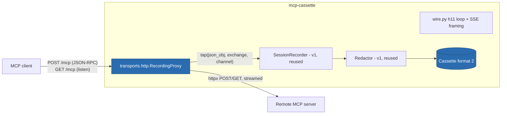

# ITER_01_v2 — Record over Streamable HTTP

## §01 · Concept

> Unchanged — see SKELETON_v2 § 01.

## §02 · Architecture



Schema: **no new fields beyond SKELETON_v2** — this iteration populates
`transport: "http"`, `server_url`, `session_id`, `Message.exchange`,
`Message.channel`. Pinned-down behaviors those fields imply:

- **`exchange`** increments per client HTTP request the proxy forwards — POST and GET
  alike (a GET listening connection is one exchange of its own). The request body
  message and every message in its response (one JSON object, or N objects arriving as
  SSE events) share the exchange number. Server→client messages are stamped
  `channel: "post"` or `channel: "get"` by the stream that carried them; client-sent
  messages have `channel: None`.
- **`session_id`** is captured from the first upstream response's `Mcp-Session-Id`
  header. Stored once at cassette level, evidence only. Subsequent client requests
  echoing it are forwarded verbatim; the header value is **not** additionally stored
  per message (it's constant per session).
- **`t_offset_ms`** semantics unchanged from v1: monotonic from proxy start, every
  message, replay ignores it.

## §03 · Tech Stack

> Unchanged — see SKELETON_v2 § 03. No dependencies beyond the `[http]` extra
> established there.

## §04 · Backend

### New/changed modules

- `transports/http/proxy.py` — real. Front end: `wire.py`'s h11 loop on an anyio TCP
  listener bound to `127.0.0.1:<port or 0>`; back end: one `httpx.AsyncClient` with
  streaming enabled.
- `record/recorder.py` — `SessionRecorder.on_message` gains optional
  `exchange`/`channel` kwargs (defaulting to `None`, so the stdio call sites are
  untouched). Classification rules are **identical** to v1 — JSON-RPC shape only.
- `cassette.py` — writes `format_version: 2` always (for both transports from this
  release on); loader accepts 1 and 2 (established at skeleton).
- `cli.py` — `record --url URL` wired; `--url` and `-- CMD` are mutually exclusive
  (argparse group), `--port N` optional, bound URL printed to stderr on startup so
  the operator can paste it into agent config.

### Proxying semantics (the decisions that make capture faithful)

1. **Streaming passthrough, never buffering.** For an upstream SSE response the proxy
   forwards each event to the client **as it arrives** (h11 chunked writes, flush per
   event) while tapping a copy. Buffering the stream would break server→client
   requests mid-stream (ITER_03_v2's raw material) and distort timing. Each SSE
   `data:` payload is one JSON-RPC message → one tap call. Applies equally to
   `Content-Type: application/json` responses (single tap) — the proxy branches on the
   upstream response content type, exactly the dual mode the spec defines.
2. **GET listening stream.** A client `GET /mcp` with `Accept: text/event-stream` is
   forwarded as a long-lived upstream GET; events are streamed through and tapped with
   `channel: "get"`. The proxy holds at most one GET stream (per spec) and closes it
   when either side does.
3. **Observational only.** Bytes are forwarded verbatim — the proxy never rewrites
   bodies, never re-frames events, never injects headers beyond hop-by-hop necessities
   (`Host`, connection management). `protocol_version`/`server_info` extraction watches
   the `initialize` exchange pass through, same as v1.
4. **Header policy (recording):** headers are **not** part of the cassette message
   model. Exactly three things are lifted from headers into the cassette:
   `Mcp-Session-Id` → `session_id`, content type → framing decision, and nothing else.
   `Authorization` (and any header) is forwarded upstream untouched but **never
   written** — this is stronger than redaction: there is no field it could occupy.
   Body redaction is v1's `Redactor`, unchanged, defaults on.
5. **Concurrent POSTs** (agents parallelize tool calls): each connection is a task in
   the proxy's task group; taps funnel into `SessionRecorder.on_message` under its
   existing `anyio.Lock`, so `seq` stays strictly ordered while exchanges interleave —
   `exchange` is what lets a reader reconstruct per-request grouping afterward.

### Shutdown paths (all finalize the cassette — v1 invariant, new triggers)

Operator SIGINT/SIGTERM (and the Windows CTRL_BREAK branch) → cancel listener, close
upstream client, drain taps, write, exit 130. Client-side idle is *not* a shutdown
trigger (HTTP has no EOF-on-stdin analog): recording ends on signal, or on `--max-idle
SECONDS` if given (optional flag, default off; documented as the unattended-CI escape
hatch). Upstream connection refusal/5xx at first contact → error out *before* creating
a cassette file, naming the URL — a cassette of nothing but a failed connect is noise.

### Tests for this iteration

Against `tests/reference_http_server` with a scripted httpx client stub
(initialize → tools/list → tools/call ×2, one call answered as SSE with an
interleaved progress notification, plus a GET stream carrying one server
notification): cassette validates as format 2; exchange grouping and `channel`
stamping correct; SSE multi-message capture ordered; `session_id` captured;
`Authorization: Bearer planted` sent by the stub appears **nowhere** in the file
(byte-scan assertion); mid-session SIGINT → valid loadable cassette; single-JSON
and SSE response modes both round-trip; concurrent POSTs keep `seq` strictly
increasing. `inspect` on an http cassette prints transport, server host, exchange
count.

### Run locally

```
uv run mcp-cassette record --cassette demo-http.json --url http://127.0.0.1:8931/mcp
# proxy prints: recording at http://127.0.0.1:61423/mcp  → point the agent there
```

Environment variables: none added.

## §05 · Frontend / Developer Surface

> Unchanged — see SKELETON_v2 § 05. (`record --url` graduates stub→real per the
> registered-but-loud convention; `--max-idle` is the only flag added, documented
> inline in `--help`.)
