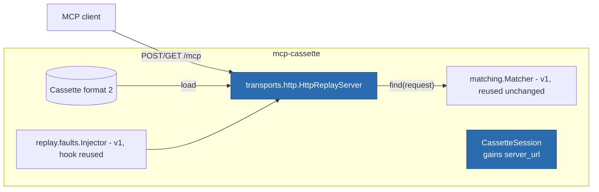

# ITER_02_v2 — Replay over Streamable HTTP

## §01 · Concept

> Unchanged — see SKELETON_v2 § 01.

## §02 · Architecture



No schema changes. `MatchConfig` applies **unchanged** — matching is over JSON-RPC
message shape, which is transport-independent by design; `ordering`, `ignore_params`,
`on_unmatched`, `rewrite_protocol_version` all keep their ITER-02-era (v1) semantics.

## §03 · Tech Stack

> Unchanged — see SKELETON_v2 § 03. No new dependencies; the replay server is
> `wire.py` + the existing matcher.

## §04 · Backend

### New/changed modules

- `transports/http/server.py` — real: h11 loop serving `POST /mcp` and `GET /mcp` on
  `127.0.0.1`, matcher lookups, fault hook at the identical point as stdio replay
  (after match, before response write).
- `session.py` — `CassetteSession.server_url(real_url: str) -> str`: record modes →
  a `RecordingProxy` bound URL; replay modes → an `HttpReplayServer` bound URL.
  Command-vs-URL is decided by which method the test calls; a stdio cassette handed
  to `server_url` (or vice versa) fails fast naming the transport mismatch.
- `cli.py` — `serve` transport inference real: loads the cassette, branches on
  `transport`; `--port N` honored for http (default 0, bound URL printed).

### Replay semantics (deterministic, and faithful to the recorded shape)

1. **Response mode mirrors the recording.** An exchange recorded as a single JSON
   body replays as `Content-Type: application/json`; an exchange recorded as an SSE
   stream replays as `text/event-stream`, emitting the recorded messages of that
   exchange in `seq` order (progress notifications before the response, exactly as
   captured), then closing the stream. `t_offset_ms` is ignored — no sleeps.
2. **Session lifecycle is ours, not the recording's.** On `initialize` the server
   issues a fresh deterministic id (`mcc-<8 hex of cassette content hash>`) in
   `Mcp-Session-Id` — never the recorded `session_id` (that is evidence; replaying it
   invites accidental reuse against live systems). Requests missing/mismatching the
   issued id → HTTP 404 per the Streamable HTTP spec, which well-behaved clients
   handle by re-initializing.
3. **Recorded GET-stream messages** (`channel: "get"`) are emitted on the client's GET
   stream, anchored by the same trigger computation as v1's notification anchoring:
   each is released immediately after the matched response of the exchange it followed
   in `seq` order (free-floating ones after `initialize`). If the client never opens a
   GET stream, undelivered messages are reported in the end-of-session stderr summary
   as a warning — not an error; a client that ignores optional streams is conforming.
4. **Unmatched requests** → the v1 JSON-RPC error (`-32001`, method + params digest)
   delivered as a 200 JSON body (transport-level errors would mask the message), the
   miss recorded, and the miss-count surfaced at shutdown exactly as stdio does.
5. **Concurrency:** connections are tasks; matcher queue consumption
   (`ordering: per_method`) is guarded by one lock so concurrent identical calls
   consume queue positions deterministically by arrival order at the lock.
6. **Shutdown:** the server runs until its owner stops it (fixture teardown or
   Ctrl+C on `serve`); exit 0 with no misses, exit 3 with misses + summary — the
   CI-visible failure signal, unchanged.

### Fault matrix over HTTP (same five types, transport-mapped)

| `type` | HTTP replay behavior at the hook point |
|---|---|
| `delay` | sleep `ms`, then respond normally |
| `timeout` | accept the POST, never complete the response (headers sent, body never finishes); other connections keep serving — a hung tool, not a dead server |
| `error` | recorded response replaced by a JSON-RPC error object, 200 body, same `id` |
| `malformed` | `truncate`: close mid-body after partial bytes; `not_json`: a non-JSON body / SSE data line; `wrong_id`: valid JSON, unknown `id` |
| `disconnect` | close the TCP connection — before the response (default) or just after (`after_response: true`); with a live GET stream, that stream is closed too (server death kills everything) |

Interaction rules (one fault per matched request; queue-position consumption;
`initialize` exemption) are v1's, verbatim — the injector is the same object.

### `new_episodes` over HTTP

The one composing mode: `CassetteSession` keeps the real URL it was handed; a
replay miss falls through as a live `httpx` request via the recording path and the
novel exchange is appended. Requires the `[http]` extra and network at test time —
same posture as stdio `new_episodes` requiring the real server command. CI's
`MCP_CASSETTE_MODE=none` invariant is untouched.

### Tests for this iteration

Round-trip: replay ITER_01_v2's recorded session against the scripted client with the
reference server stopped; assert semantically identical results including the SSE
exchange and GET-stream delivery. Plus: session-id issuance + 404 on bad id; per-method
queue under two concurrent identical `tools/call`s; each fault type over HTTP
(timeout leaves a second connection answerable; disconnect closes GET stream);
unmatched → 200-body error + exit 3; mode matrix via pytester for `server_url`
(`once` records then replays; `none` fails absent cassette; `all` re-records;
`new_episodes` appends exactly the novel exchange); transport-mismatch fast failure.

### Run locally

```
uv run mcp-cassette serve demo-http.json          # prints http://127.0.0.1:<port>/mcp
# point the agent's remote-server URL at exactly that — drop-in replacement
```

Environment variables: none added.

## §05 · Frontend / Developer Surface

`server_url` joins `server_command` as the fixture's second (and last) interception
surface; the README's canonical example gains the remote twin:

```python
def test_agent_reads_remote_tracker(mcp_cassette):
    url = mcp_cassette.server_url("https://mcp.example.com/mcp")
    result = run_my_agent(mcp_servers={"tracker": {"url": url}})
    assert "triaged" in result
```

First run records through the proxy; every run after replays offline. Failure messages
keep the name-the-fix convention: transport mismatch names both transports and the
right method; a served http cassette without the `[http]` extra names the pip command.
`inspect --method` works on http cassettes unchanged.
