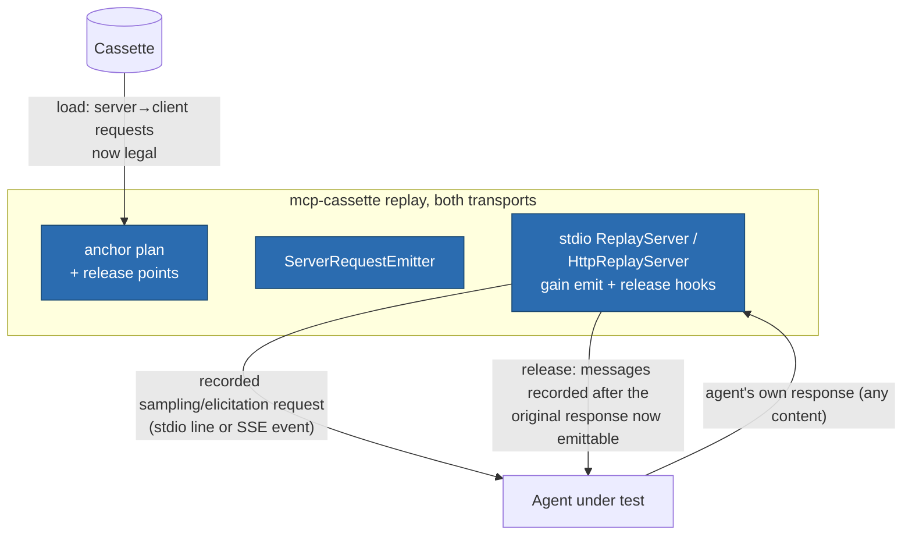

# ITER_03_v2 — Server-initiated request replay

## §01 · Concept

> Unchanged — see SKELETON_v2 § 01.

## §02 · Architecture



No schema changes — server→client requests were already recorded generically by both
proxies (`kind: "request"`, `sender: "server"`; over HTTP additionally
`channel: "post"|"get"`). This iteration is purely replay-side. `MatchConfig` is
untouched: agent responses to server requests are **not matched** (see §04), so no
config knob exists for them in MVP — response-assertion is a named deferral on the
terminator.

## §03 · Tech Stack

> Unchanged — see SKELETON_v2 § 03. No new dependencies; the emitter is anchoring
> arithmetic plus the transports' existing write paths.

## §04 · Backend

### New/changed modules

- `replay/server_requests.py` (new) — transport-neutral: builds the emission plan at
  load (which recorded server requests exist, their anchors, their release points) and
  tracks pending-response state at runtime.
- `replay/server.py` (stdio) and `transports/http/server.py` — gain the emit hook
  (alongside the existing notification-anchoring emission) and the release gate.
- `cassette.py` — `UnsupportedCassetteFeature` **deleted**; `Cassette.load` accepts
  server-initiated requests on any format version. v1 cassettes recorded from
  sampling servers, previously refused, become replayable with no re-record.

### Replay semantics (the accept-anything design, made precise)

1. **Anchored emission.** A recorded server→client request is emitted at the position
   its anchor dictates — the same trigger computation as notification anchoring:
   immediately after the matched response of the client exchange it followed in `seq`
   (free-floating → after `initialize`). Over stdio it is written as a line with its
   **recorded** `msg_id`; over HTTP it is emitted on the recorded `channel` (an SSE
   event on the triggering POST's open stream, or the GET stream — if that stream
   isn't open, it is held until one is, with the ITER_02_v2 undelivered-warning
   applying at shutdown).
2. **Accept-anything.** The agent's response (matched to the emission by JSON-RPC
   `id`) is accepted whatever its content — success or error alike, because the
   answer comes from the agent's LLM or user and will legitimately differ every run.
   It is logged at debug level and **never matched** against the recorded response.
   An agent that responds with a capability error (it can't do sampling) still counts
   as having responded.
3. **Release-on-response gating.** Messages recorded *after* the original recorded
   response to a server request — within the same exchange (HTTP) or globally after
   it in `seq` (stdio) — are gated behind receipt of the agent's response, because
   the real server only produced them after being answered. On receipt, the gate
   opens and emission/matching proceeds normally. This is what prevents the hang the
   v1 refusal existed to avoid, without refusing.
4. **No internal timeout.** If the agent never responds, the gated messages never
   release and the test hangs until pytest's own timeout — deliberately: inventing a
   default timeout would mask real agent bugs. The shutdown summary names any
   still-pending server request (method + `id`) so the hang's cause is one stderr
   read away.
5. **Faults do not target server-initiated requests** in MVP: `Fault.target.method`
   selects client requests only, unchanged from v1. (Fault-injecting the sampling
   path — e.g. never emitting the request — is a deferral, not an accident;
   listed on the terminator.)
6. **Recording side is untouched** — both proxies already capture these messages;
   the ITER_02-era rationale for a record-time warning is obsolete now that replay
   accepts them, so no warning is added.

### Tests for this iteration

`tests/reference_http_server` and the stdio reference server each gain a
`summarize`-style tool that issues a `sampling/createMessage` request mid-call, and an
elicitation variant. Scripted-agent matrix on **both** transports: agent answers
normally → gated final result arrives, full session semantically matches the
recording; agent answers with an error → gate still releases; agent never answers →
other methods stay answerable, shutdown summary names the pending request (test
asserts the summary, under its own timeout); recorded-`id` emission verified; HTTP
channel fidelity (request recorded on POST stream emits there; GET-recorded emits on
GET); a v1-era sampling cassette fixture (hand-built, format 1) loads and replays.

### Run locally

```
uv run mcp-cassette serve sampling-demo.json      # both transports; no new flags
```

Environment variables: none added.

## §05 · Frontend / Developer Surface

> Unchanged — see SKELETON_v2 § 05. (No new surface: the feature is that existing
> surfaces stop refusing. `inspect` already lists server→client requests via its
> per-method counts; the shutdown summary's pending-request line is the only new
> user-visible text, and it follows the name-the-cause convention.)
