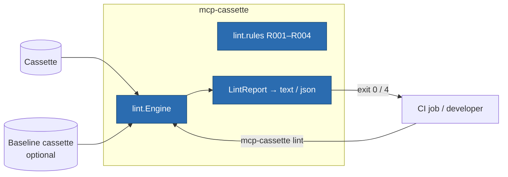

# ITER_04_v2 — Security lint (v2 MVP terminator)

## §01 · Concept

> Unchanged — see SKELETON_v2 § 01.

## §02 · Architecture



`LintFinding` / `LintReport` were defined in SKELETON_v2 § 02; fields unchanged,
semantics finalized here. Lint is **read-only over cassettes** — it never touches
replay or record paths, and a cassette is never mutated or annotated.

## §03 · Tech Stack

> Unchanged — see SKELETON_v2 § 03. Stdlib `re` + bundled pattern data
> (`lint/patterns.py`, plain Python constants — no data-file loading machinery).

## §04 · Backend

### New/changed modules

- `lint/engine.py` — real: extract lintable surfaces from a cassette (every tool
  `name`/`description` from recorded `tools/list` results; every text content block
  from recorded `tools/call` results), run enabled rules, assemble `LintReport`.
- `lint/rules.py` + `lint/patterns.py` — the four rules and their heuristics.
- `cli.py` — `lint CASSETTE [--baseline OLD] [--format text|json] [--select R00X]...
  [--ignore R00X]...` wired. Exit 0 = no findings at `error` severity; exit 4 =
  at least one `error` finding (warnings alone exit 0 — CI decides via `--format json`
  if it wants to fail on warnings); exit 2 = usage/load errors, as everywhere.

### The rules (each precise enough to test)

| Rule | Severity | Fires on |
|---|---|---|
| `R001` instruction injection in tool description | error | description matches bundled imperative-override patterns: ignore/disregard-previous-instructions phrasing, do-not-tell/inform-the-user phrasing, instructions addressed to the model rather than describing the tool, hidden-emphasis markers (`<important>`, `IMPORTANT:` blocks inside descriptions) |
| `R002` tool description drift vs baseline | error | `--baseline` given, and a tool name present in both cassettes has a changed `description` (or changed `inputSchema`) — the "rug pull" pattern; report includes a unified diff of the two descriptions |
| `R003` duplicate tool names | warning | two tools in one `tools/list` result share a `name` — shadowing within the recorded server |
| `R004` instruction-shaped tool results | warning | a `tools/call` result text block matches the R001 pattern set — data trying to be instructions; warning not error because result text legitimately quotes such phrases more often than descriptions do |

Heuristic honesty, stated in `--help` and the README: these are pattern rules, not a
guarantee — a clean lint is absence of *known* smells, nothing more. New tools appearing
relative to a baseline are **not** flagged (servers legitimately grow); only changed
descriptions/schemas for the *same* name are.

### Engine mechanics

- Locators are JSON pointers into the cassette
  (`/messages/17/payload/result/tools/2/description`) so a finding is one `inspect`
  or editor-jump away from its evidence.
- `--baseline` loads both cassettes through the ordinary format-1|2 loader —
  cross-version comparison (v1 stdio baseline vs v2 http recording of the same
  server) works by construction, since tool surfaces live in payloads.
- Redaction interplay: linting runs on the cassette as written — post-redaction.
  A redacted description (`"REDACTED"`) is skipped with a note-level line in text
  output rather than pattern-matched, so redaction can't manufacture findings.
- Determinism: same cassette(s) + same rule selection ⇒ byte-identical
  `--format json` output (findings sorted by locator) — lint output is diffable in CI
  artifacts like everything else this library writes.

### Tests for this iteration

Fixture cassettes (hand-built, both format versions): planted R001 phrases in a
description → error finding with correct locator; benign descriptions → clean exit 0;
baseline pair with a changed description → R002 with diff; added-tool baseline pair →
no finding; duplicate names → R003 warning, exit 0; planted instruction text in a
result → R004; `--select`/`--ignore` filtering; JSON output schema round-trips through
`LintReport.model_validate`; redacted-description skip. Plus one end-to-end: record
the reference server (its descriptions are benign) → `lint` exits 0.

### Run locally

```
uv run mcp-cassette lint demo-http.json
uv run mcp-cassette lint new.json --baseline tests/cassettes/old.json --format json
```

Environment variables: none added (final v2 set: `MCP_CASSETTE_MODE` only).

## §05 · Frontend / Developer Surface

`lint` is a CLI/CI surface only — deliberately not a fixture concern (a lint failure
is a supply-chain review moment, not a per-test assertion; teams wire it as a separate
CI step on committed cassettes). Text output is one line per finding:
`R002 error /messages/17/... tool "search": description changed vs baseline (+3 −1 lines)` —
cause and evidence in one line, per the standing failure-message convention. The
README gains a "linting your cassettes" section with the two-command CI recipe above.

## Out of MVP scope

Consciously deferred — v2's hard edge:

- Legacy HTTP+SSE transport (deprecated in spec 2025-03-26; will not be built)
- Resumability replay fidelity: `Last-Event-ID` resume, GET-stream reconnection replay
- OAuth / auth flows beyond header passthrough with never-persist (recording) — no token
  acquisition, no refresh simulation
- Response-assertion mode for sampling/elicitation (accept-anything is the only MVP
  mode; a `MatchConfig`-style knob is the named future shape)
- Fault injection targeting server-initiated requests (e.g. suppressing a sampling
  request to test agent patience)
- Content-based secret detection (entropy scanning; redaction stays key-structural)
- Custom/pluggable lint rules and per-project pattern packs (bundled R001–R004 only)
- Cassette format migration tooling (`format_version` gate + optional-field widening
  made it unnecessary for 1→2; field stays reserved)
- Replay honoring recorded timing (`t_offset_ms` pacing)
- Multi-server orchestration in a single cassette (compose multiple fixtures)
- Richer inspect/diff UX beyond current summaries and filters
- npm/TypeScript port; packaged GitHub Action
- Graceful-interrupt finalize for `new_episodes` (both transports; EOF/teardown-driven
  only, as in v1)
