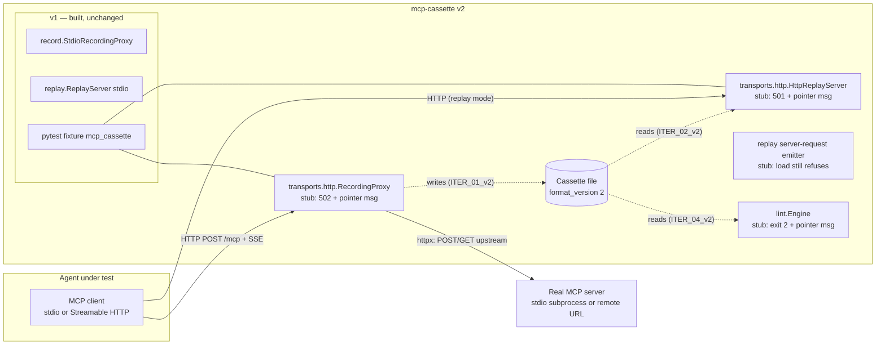

# SKELETON_v2 — mcp-cassette v2

## §01 · Concept

v1 made **local** agents testable: record a stdio MCP session once, replay it as a
deterministic mock server, inject faults, all through a pytest fixture. v2 extends the
same promise to the two places v1 drew hard edges:

1. **Remote servers.** Streamable HTTP is now the sole non-deprecated remote transport
   (legacy HTTP+SSE was deprecated in spec 2025-03-26 and is being sunset across the
   ecosystem through 2026). v2 records and replays Streamable HTTP sessions — single
   `/mcp` endpoint, JSON *and* SSE-stream response modes, `Mcp-Session-Id` lifecycle.
2. **Server-initiated requests.** Sampling and elicitation cassettes, which v1's
   `ReplayServer` refused at load, become replayable on **both** transports via
   anchored emission and accept-anything response handling.
3. **Security lint** — the report's demoted "possible later feature" graduates:
   heuristic rules over recorded tool descriptions and results (prompt-injection
   patterns, description drift between recordings) as a CI-friendly `lint` subcommand.

**The single most important v2 flow:** a developer whose agent talks to a remote MCP
server swaps the server URL in their agent's config for a local proxy URL once, a
cassette is written, and from then on the pytest suite replays it offline — same
fixture, same record modes, same fault matrix as stdio.

Design stance, carried forward verbatim from v1 and still load-bearing: mcp-cassette
operates at the **transport level**, treats messages semi-opaquely, and does **not**
depend on the official `mcp` SDK at runtime. For HTTP this means owning the wire
framing (h11 state machine + hand-rolled SSE event framing) exactly as v1 owns
newline-delimited stdio framing — no ASGI framework, no SDK types.

## §02 · Architecture



### Existing v1 surface (restated so this skeleton is self-contained)

Built and green on Linux/macOS/Windows: `Cassette.load/save` (atomic, diffable),
`StdioRecordingProxy` with redaction, stdio `ReplayServer` with `MatchConfig`
(`match_on`, `ignore_params`, `ordering: per_method|strict|none`,
`on_unmatched: error`, `rewrite_protocol_version`), `FaultOverlay`/`Fault`
(delay/timeout/error/malformed/disconnect, one-fault-per-request, queue-position
consumption), pytest fixture with modes `once|none|all|new_episodes` resolved via
`MCP_CASSETTE_MODE` > marker > ini > default, path convention
`tests/cassettes/<module>/<test>.mcp.json`, CLI `record|serve|inspect`. v2 extends
this; nothing in it is rewritten.

### Data model — cassette schema v2 (pydantic; extends, never contradicts, v1)

`format_version` becomes **2**. All new fields are optional-with-defaults, so
**v1 cassettes load unchanged** (the loader accepts 1 and 2; new recordings always
write 2). No migration tool needed or built.

| Entity | v2 changes (v1 fields retained as-is) |
|---|---|
| `Cassette` | `transport: "stdio" \| "http"` (was literal `"stdio"`), `server_url: str \| None` (http only; recorded for provenance, host redacted on request via redaction rules), `session_id: str \| None` (the server's recorded `Mcp-Session-Id`, evidence only — replay never reuses it) |
| `Message` | `exchange: int \| None` (groups messages that traveled in one HTTP request/response pair; `None` for stdio), `channel: "post" \| "get" \| None` (which stream carried a server→client message; `None` for stdio/client messages) |
| `MatchConfig` | unchanged — matching is transport-independent by design |
| `RedactionRule` | unchanged; default rule set gains `authorization`-header suppression (see ITER_01_v2) |
| `Fault` / `FaultOverlay` | unchanged fields; ITER_02_v2 defines HTTP-specific behavior for `timeout`/`disconnect` |
| `LintFinding` (new) | `rule: str` (e.g. `"R001"`), `severity: "warning" \| "error"`, `message: str`, `locator: str` (JSON pointer into the cassette), `tool: str \| None` |
| `LintReport` (new) | `cassette: Path`, `baseline: Path \| None`, `findings: list[LintFinding]` — serialized for `--format json` |

Relationships unchanged: a `Cassette` owns ordered `Message`s; everything else is
configuration or derived output, never stored inside `messages`.

### API surface (Python API + CLI; no HTTP routes of our own beyond the two local servers)

| Surface | Skeleton state | One-liner |
|---|---|---|
| `Cassette.load/save` | **real** (v2 schema, v1 read-compat) | Unchanged semantics, widened model |
| `transports.http.RecordingProxy(server_url, cassette_path, redaction=[], port=0).run() -> bound_url` | stub: binds, serves 502 `"HTTP recording lands in ITER_01_v2"` | Local reverse proxy; agent points at `bound_url` |
| `transports.http.HttpReplayServer(cassette, match=..., faults=None, port=0).run() -> bound_url` | stub: binds, serves 501 `"HTTP replay lands in ITER_02_v2"` | Local mock Streamable HTTP server from a cassette |
| stdio `ReplayServer` sampling path | stub: `Cassette.load` still raises `UnsupportedCassetteFeature` — message now names ITER_03_v2 | Replaced in ITER_03_v2 |
| `lint.run(cassette, baseline=None, rules=None) -> LintReport` | stub: raises `NotImplementedError("ITER_04_v2")` | Heuristic security scan |
| fixture `mcp_cassette.server_url(real_url: str) -> str` | stub: raises `NotImplementedError("wired in ITER_02_v2")` | HTTP analog of `server_command` — URL substitution is the whole trick |
| CLI `record --cassette PATH --url URL [--port N] [--redact RULE]...` | stub: registered, exits 2 with pointer | Record a remote server (mutually exclusive with `-- CMD`) |
| CLI `serve CASSETTE [--port N] [--faults FILE] ...` | transport inferred from `cassette.transport`; http branch stub exits 2 | One subcommand, two transports |
| CLI `lint CASSETTE [--baseline OLD] [--format text\|json]` | stub: registered, exits 2 with pointer | CI-friendly scan; exit 0 clean / 4 findings |

No auth of our own, no database, no queues. Cross-origin: the local servers bind
`127.0.0.1` only and serve non-browser MCP clients; CORS is explicitly not implemented.

## §03 · Tech Stack

- **Language/runtime:** Python ≥ 3.12; Linux, macOS, Windows (v1 delivered Windows in
  ITER_05; v2 inherits the platform claim and its CI matrix).
- **Packaging:** hatchling + uv, unchanged. New **optional extra** `mcp-cassette[http]`:
  - `httpx` — upstream client for the recording proxy: async, anyio-compatible,
    first-class streaming so SSE bytes pass through unbuffered.
  - `h11` — sans-io HTTP/1.1 state machine for **both** local servers (proxy front end
    and replay server), driven directly from an `anyio` TCP listener. Rationale over an
    ASGI stack (starlette/uvicorn): h11 is tiny, dependency-free, and keeps us at the
    wire level where this library philosophically lives; SSE event framing is
    hand-rolled (it is line-based — the moral twin of v1's stdio framing helper).
  - Core install remains `anyio` + `pydantic` only. Importing `transports.http`
    without the extra raises a clear `ImportError` naming `pip install mcp-cassette[http]`.
- **Lint:** stdlib `re` + bundled heuristic pattern data. No new dependency.
- **Dev-only:** the official `mcp` SDK (already a dev dep) now also powers
  `tests/reference_http_server` — the same echo/add/notify server exposed over
  Streamable HTTP, plus (ITER_03_v2) a sampling tool. Never a runtime dep.
- **CI:** existing 3-OS matrix; the `[http]` extra installed in the test job.

## §04 · Backend (the library)

### Module structure (additions to the v1 tree)

```
src/mcp_cassette/
├── cassette.py              # schema v2: widened models, format_version 1|2 gate
├── transports/
│   ├── __init__.py
│   └── http/
│       ├── __init__.py      # guarded import; ImportError names the [http] extra
│       ├── wire.py          # h11 server loop on anyio TCP + SSE event framing (real at skeleton)
│       ├── proxy.py         # RecordingProxy (skeleton: 502 stub)
│       └── server.py        # HttpReplayServer (skeleton: 501 stub)
├── lint/
│   ├── __init__.py
│   ├── engine.py            # rule runner (stub)
│   └── rules.py             # LintFinding models real; rules stub
├── cli.py                   # record --url / serve inference / lint registered
└── ...                      # all v1 modules unchanged
tests/
├── reference_http_server/   # dev-dep SDK server over Streamable HTTP
└── test_http_wire.py        # skeleton test: wire.py round-trips requests + SSE frames
```

### Representative real-at-skeleton piece — SSE event framing (everything hangs off it)

```python
# transports/http/wire.py
async def sse_events(byte_stream):
    """Yield decoded SSE events (data payload, event id) from a byte stream.
    Mirrors v1's buffered_lines: buffers partial reads, tolerates a missing
    trailing blank line at EOF, never raises on unknown fields (ignores them)."""
```

Conventions carried from v1, restated because the whole design leans on them:
1. **Framing is owned by us.** Stdio = newline-delimited JSON; HTTP = h11 events +
   SSE framing per the Streamable HTTP transport spec. A body that fails `json.loads`
   is a `kind="raw"` message, one warning per session — identical policy both transports.
2. **Stubbed behavior is loud, never silent.** Every v2 stub exits non-zero / raises /
   serves an error status naming the iteration that implements it.
3. **Recorded cassettes are pristine evidence** — faults are overlays; lint is
   read-only; the recorded `session_id` is stored but never re-served.

### Run locally

```
uv sync --extra http && uv run pytest       # v1 suite + http wire tests, all green
uv run mcp-cassette record --cassette d.json --url https://example.com/mcp   # exits 2, names ITER_01_v2
uv run mcp-cassette lint d.json             # exits 2, names ITER_04_v2
```

### Environment variables

`MCP_CASSETTE_MODE` only (v1). No new variables reserved — ports are ephemeral
(`port=0`, bound port returned/printed) precisely to avoid config surface.

## §05 · Frontend / Developer Surface

No GUI; the surfaces are the CLI and the fixture, as in v1.

- **New surfaces:** `record --url`, transport-inferring `serve`, `lint`, and fixture
  `server_url(real_url)`. All registered in the argparse tree / plugin from this
  skeleton onward so `--help` shows the full intended v2 surface.
- **Placeholder strategy:** unchanged v1 convention — **render disabled with a clear
  note**: unimplemented subcommands exit 2 naming their iteration; stub servers bind
  and answer with 501/502 + the pointer message (binding at skeleton proves the wire
  layer end-to-end, the v2 analog of v1's "passthrough writes an empty shell").
- **Failure-message convention** carries: every failure names its cause and the fix
  (missing `[http]` extra → the pip command; http cassette served without extra →
  same; lint findings → rule id + JSON pointer + one-line remedy).
- **Run locally:** `uv run mcp-cassette --help`.
