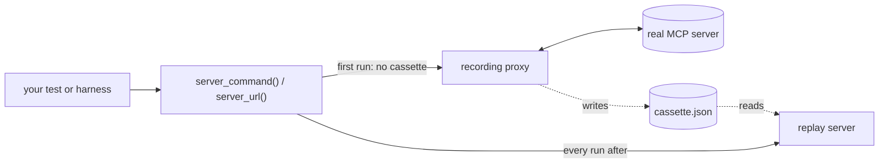

# mcp-cassette Guide

mcp-cassette records real MCP sessions between an agent and an MCP server — local stdio
or remote Streamable HTTP — into **cassettes** (structured JSON files you commit), then
replays those cassettes as deterministic mock MCP servers. Your agent test suite stops
hitting live servers.

## The mental model

mcp-cassette never patches your agent. It hands you a **command list** (stdio) or a
**URL** (HTTP) to drop into the agent's MCP server configuration, in the slot where the
real server would go. What sits behind that slot changes between runs:

On the first run that slot holds a recording proxy wrapping the real server, and every
JSON-RPC message in both directions is captured. On every run after, it holds a replay
server answering from the cassette — no network, no subprocess, no live dependency.

The unit of recording is the **whole session** — every message from server launch to
shutdown, all tool calls included — never an individual tool call. Re-recording therefore
rewrites the entire cassette file, not one entry inside it.

Three front doors open the same machinery, and the picture above is identical for all
three:

| Door | You call | Use it when |
|---|---|---|
| pytest fixture | `mcp_cassette.server_command(...)` | your tests are a pytest suite |
| library | `with use_cassette(...) as session:` | your harness is not pytest |
| CLI | `mcp-cassette record` / `serve` | you drive recording by hand |

The library door covers a notebook, a benchmark runner, or another test framework; the CLI
door also covers a shell script and an agent configured outside Python.

Under the hood it works at the transport level (newline-delimited JSON-RPC over stdio, or
Streamable HTTP) and treats messages semi-opaquely, so it works with any MCP client
unmodified and never imports the `mcp` SDK at runtime.

## Where to start

The two audiences do not mix:

- **Test authors** (you write tests that exercise an agent): start at
  [Getting started](getting-started.md), then the `HT` how-to chapters.
- **Operators** (you own the CI pipeline, the recording runs, and the cassette files):
  start at [OP-01. Installation](operations/OP-01-install.md), then
  [OP-03. CI pipeline](operations/OP-03-ci.md).

## Part I — Test authors

- [Getting started](getting-started.md) — install, then one record-and-replay through
  whichever of the three doors fits your setup.
- **HT-01** [Record and replay a stdio server](how-to/HT-01-record-and-replay.md) — the
  core loop through all three doors, record modes, re-recording.
- **HT-02** [Record and replay a remote HTTP server](how-to/HT-02-remote-http.md) —
  `server_url`, the `[http]` extra.
- **HT-03** [Use it as a library](how-to/HT-03-use-as-a-library.md) — `use_cassette` for
  harnesses that are not pytest suites.
- **HT-04** [Inject faults](how-to/HT-04-inject-faults.md) — drive a resilience matrix off
  one recording.
- **HT-05** [Replay timing](how-to/HT-05-replay-timing.md) — replay recorded latency when
  your agent's timeout or retry logic depends on it.
- **HT-06** [Inspect and diff cassettes](how-to/HT-06-inspect-and-diff.md) — read the
  timeline, grep payloads, compare two recordings.
- **HT-07** [Redact secrets](how-to/HT-07-redact-secrets.md) — what is scrubbed by default
  and how to add rules.
- **HT-08** [Lint with your own pattern packs](how-to/HT-08-lint-pattern-packs.md) — extend
  the bundled rules with project-specific regexes.
- **HT-09** [Gate a drifting server surface](how-to/HT-09-gate-a-drifting-server.md) — fail
  the build when a third-party tool description or schema moves under you.
- [Troubleshooting](troubleshooting.md) — symptom to fix.

## Part II — Operators

- **OP-01** [Installation](operations/OP-01-install.md) — requirements, extras, health
  check.
- **OP-02** [Configuration](operations/OP-02-configure.md) — every mode, ini option, env
  var, and matching setting.
- **OP-03** [CI pipeline](operations/OP-03-ci.md) — how to wire cassettes into CI so
  nothing hits a live server.
- **OP-04** [CLI reference](operations/OP-04-cli-reference.md) — commands, flags, exit
  codes.
- **OP-05** [Runbook: replay misses and failed recordings](operations/OP-05-runbook-replay-misses.md)
  — the two incidents that actually happen.

## Chapter codes

The two chapter series carry stable codes: `HT` how-to, `OP` operations. The code is the
filename and the heading prefix, so `OP-02` is `operations/OP-02-configure.md` and "see
§OP-02.4" means section 4 of that chapter. Numbering runs per series, so a new chapter
appends to its own and never renumbers the others — a code, once cited, keeps pointing at
the same chapter.

Getting started and troubleshooting carry no code. There is exactly one of each, so a
number would only ever be `01`, and they are the two pages a reader arrives at by name
rather than by citation.
